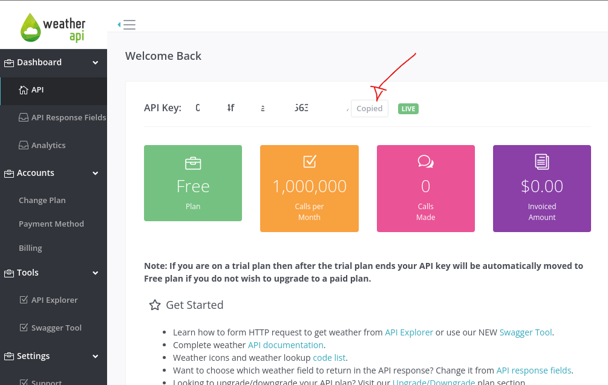

# <p align="center">Projeto iChoveu</p>

## Contexto

Esse projeto é um site simples de previsão do tempo, `ele já tem sua estilização pronta`, bem como uma parte do código. O objetivo é consumir os dados de uma API, a [Weather API](https://www.weatherapi.com/), compreender o conceito assincronicidade em JavaScript e desenvolver as funções que estão em `src/helpers/`.

<details>

<summary><strong>Rode o projeto localmente</strong></summary><br>

> ⚠️ É preciso ter o [Node](https://nodejs.org/en) instalado em sua máquina.

> ⚠️ É preciso ter uma `API Key`.

<details> <br>

<summary>Obtendo uma KEY</summary>

- Crie uma conta no [Weather API](https://www.weatherapi.com/signup.aspx) para ter uma `API Key`.



</details>

⚠️ Crie um arquivo`.env` na raiz do projeto e cole a sua chave. Na raiz desse projeto há um exemplo `.env.example` veja:

```Typescript
VITE_TOKEN=paste_your_API_KEY_here
```

Clone o repositório:

```JSON
git clone git@github.com:mairess/project-iChoveu.git
```

Instale as dependências:

```JSON
npm install
```

Inicie o vite server:

```JSON
npm run dev
```

</details>

<details>

<summary><strong>Rode o projeto com o docker</strong></summary><br>

> ⚠️ É preciso ter o [Docker](https://www.docker.com/get-started/) instalado em sua máquina.

Clone o repositório:

```JSON
git clone git@github.com:mairess/project-iChoveu.git
```

Suba o container:

```JSON
docker compose up -d
```

O vite server estará disponível na porta `3000`:

```HTML
http://localhost:3000
```

</details>

## Competências desenvolvidas

- Compreensão de `promises` e `fetch`.
- Compreensão de `async` e `await`.
